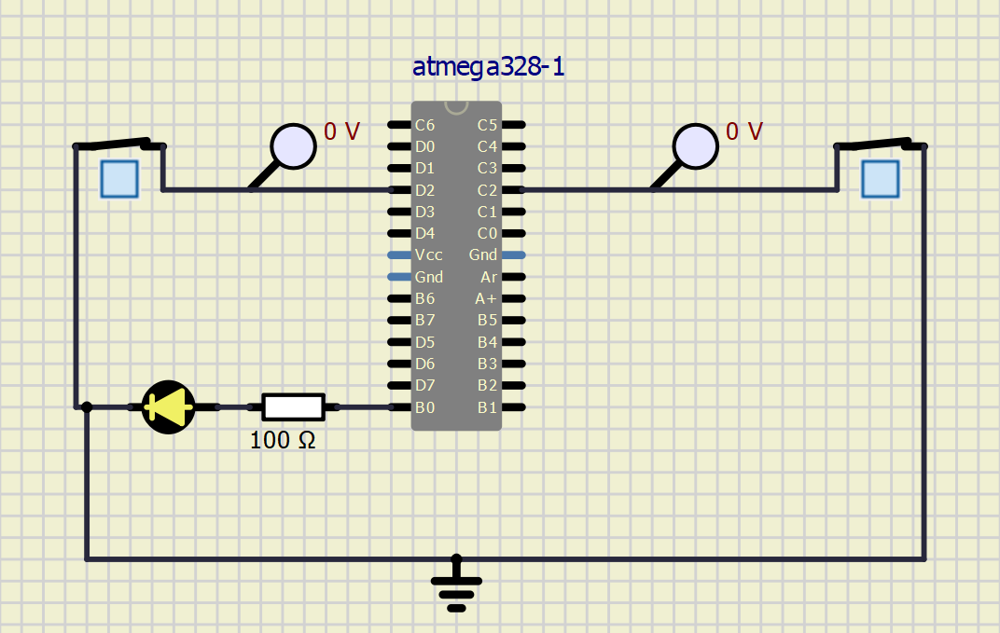
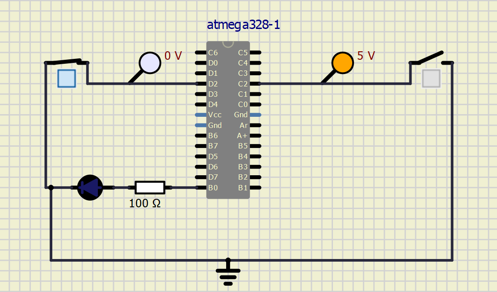

# embC-261625
this repositry was made in the sole purpose of submission of out embedded C activities.

# Activity One

## In Action

|ON|OFF|
|:--:|:--:|
|||

#### CI and Code Quality

|Build|Cppcheck|Codacy|
|:--:|:--:|:--:|
||[]

